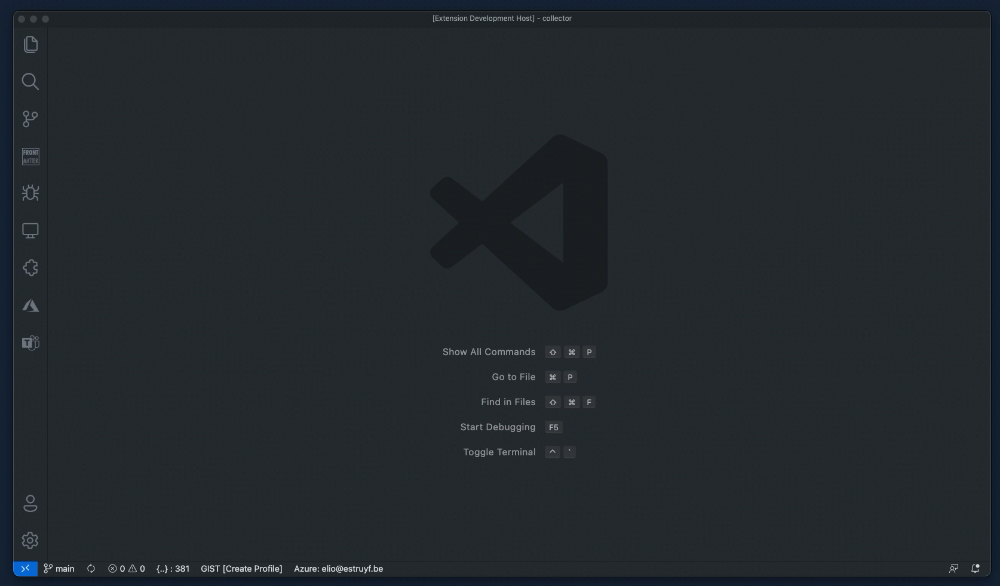
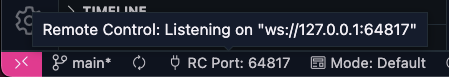
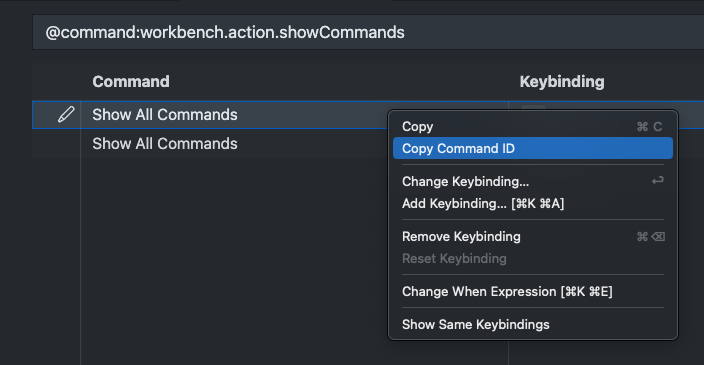

<p align="center">
  <a href="https://marketplace.visualstudio.com/items?itemName=eliostruyf.vscode-remote-control">
    
  </a>
</p>

<p align="center">
  <a href="https://marketplace.visualstudio.com/items?itemName=eliostruyf.vscode-remote-control" title="Check it out on the Visual Studio Marketplace">
    
  </a>

  
  
  

  <a href="https://www.buymeacoffee.com/zMeFRy9" title="Buy me a coffee" style="margin-left:10px">
    
  </a>
</p>

This extension allows you to remotely control Visual Studio Code. Run commands from anywhere you want on your device. The extension allows you to take VSCode automation to the next level.

In the background it uses `websockets` in order to listen to commands it should execute in your VSCode instance.



> **Info**: This is a sample of how I use the Remote Control extension in combination with the macOS [Raycast](https://raycast.com/) app.

## Extension Settings

The extension has the following settings which you can use to configure it:

- `remoteControl.enable`: enable/disable this extension
- `remoteControl.host`: the hostname of the websocket server. Default: `127.0.0.1`.
- `remoteControl.port`: set the port number for the websocket to start the server
- `remoteControl.fallbacks`: an array of port numbers to fallback to if the port is already in use.

## Current port in use

Once the extension starts, it will show the port number in the status bar. This way you can easily see which port is used.



## Usage

When you install this extension, it will automatically open a `websocket` on port `3710`. This port can be changed on in the VSCode settings. When you are going to use multiple VSCode sessions at the same time, it is best to configure it on workspace level or use the `remoteControl.fallbacks` setting to specify fallback ports when the previous one is already in use.

Once installed, you can execute `commands` for VSCode remotely by calling the Remote Control its websocket. Here is an example how to open the terminal in VSCode:

```bash
echo "{ \"command\": \"workbench.action.terminal.new\" }" | websocat ws://localhost:3710
```

The text you need to pass to the `websocket` listener is as you can see a stringified JSON object. The object currently consists of:

- `Command`: `<command-id>`

### How do I get the command ID?

To get the command ID, open the `Command Palette` and type `Show all commands`. This will give you a list with all the available commands.

Behind each command, there is a gear button. When you click on it, it brings you to the shortcut configuration. Where you can right-click on the command and copy its ID.



## Feedback / issues / ideas

Please submit your feedback/issues/ideas by creating an issue in the project repository: [issue list](https://github.com/estruyf/vscode-remote-control/issues).
